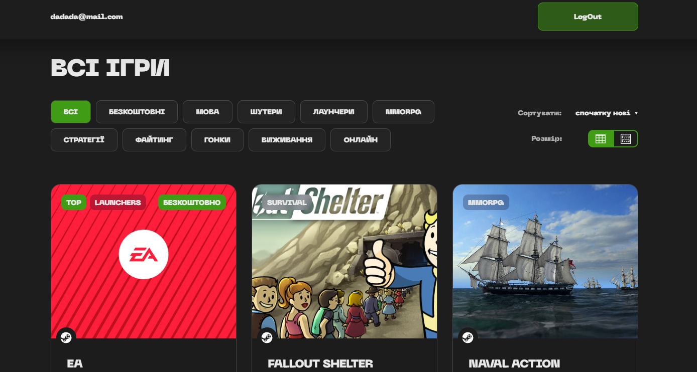

<h1 align="center">Miraplay Test Task</h1>
<h2 align="center">

## Technologies and libraries used to create the project:

- This project was created with the help of [Vite + React](https://github.com/vitejs/vite)
- [React Redux](https://react-redux.js.org)
- [Redux Toolkit](https://redux-toolkit.js.org)
- [Redux Persist](https://github.com/rt2zz/redux-persist)
- [React Router Dom](https://reactrouter.com/en/main)
- [Axios](https://axios-http.com/ru/docs/intro)
- [React Query](https://www.npmjs.com/package/react-query)
- [Node.js](https://nodejs.org/en)
- [Express](https://expressjs.com/ru/)
- [MongoDb](https://www.mongodb.com/)
- HTML
- CSS
